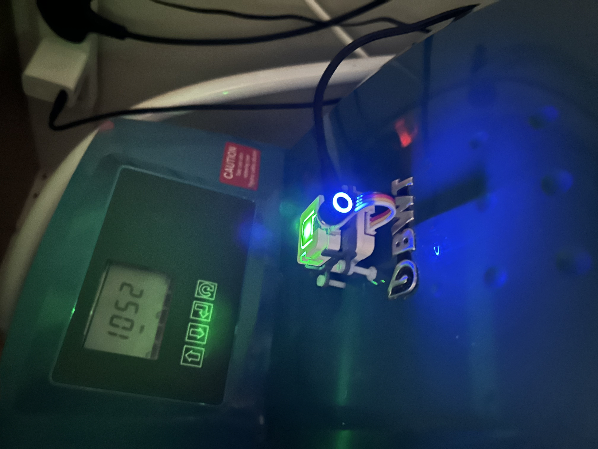
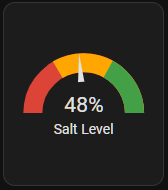
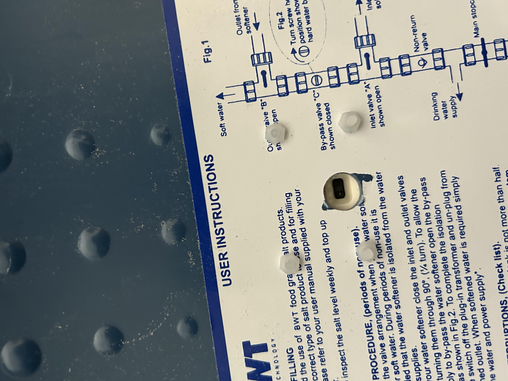
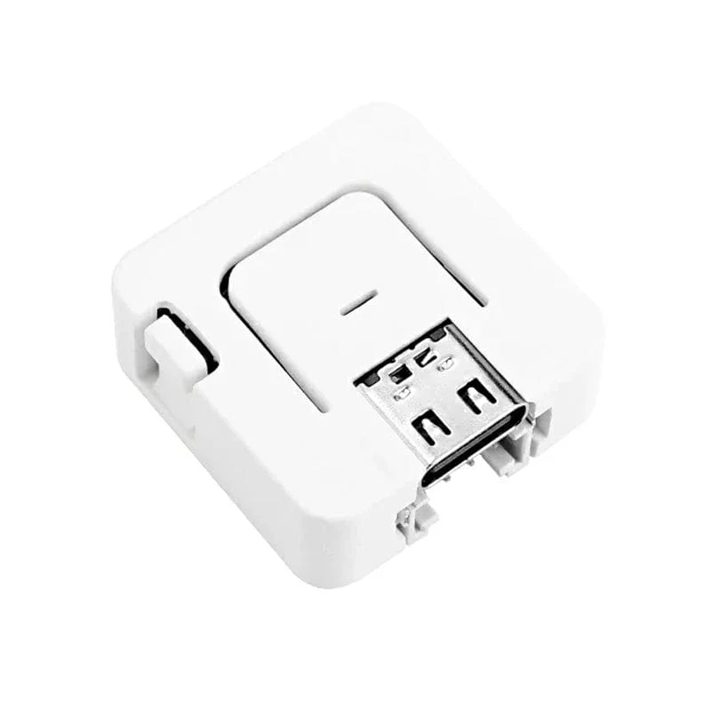
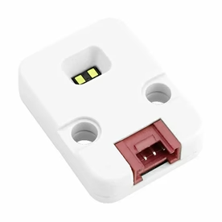
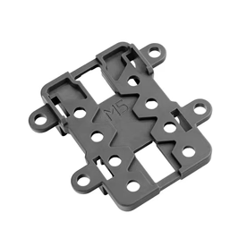
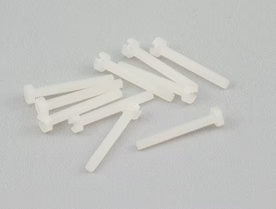
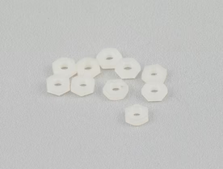
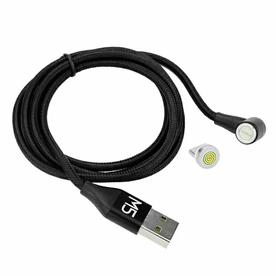

# Water Softener Smart Lid with ESPHome and M5Stack

This is my take on a water softener smart lid to report salt levels to my Home Assistant setup. In hindsight I should have gone for the VL53L0X sensor which is supported natively by ESPHome.

### In operation

The magnetic USB C cable is convenient for when you need to remove the lid for filling up with salt.

### Gauge in Home Assistant dashboard

### Top view

Note how I used the nylon nuts to level the sensor.

### Bottom view

## Components

All the components were sourced from [The PiHut](https://thepihut.com/).

| Image | Component | Price|
|---|---|---:|
|      | AtomS3 Lite ESP32-S3 Dev Kit | £9.00 |
|    | Time-of-Flight Distance Unit (VL53L1X) | £8.70 |
|   | M5Stack SandwichC Brick| £1.00 |
|  | Nylon Slotted Cheese Head Screws - M2.5 x 20mm (10 Pack) | £0.70 |
|     | Nylon Nut - M2.5 (10 Pack) | £0.70 |
|  | M5Stack Magnetic Type-C Cable with Connector - 1m | £4.40 |
||Total|£24.50|

